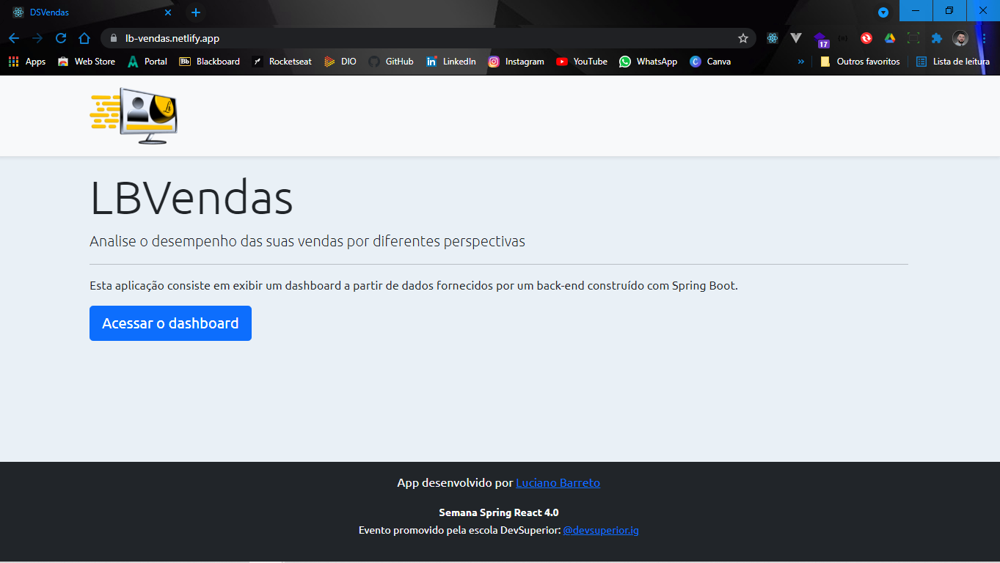
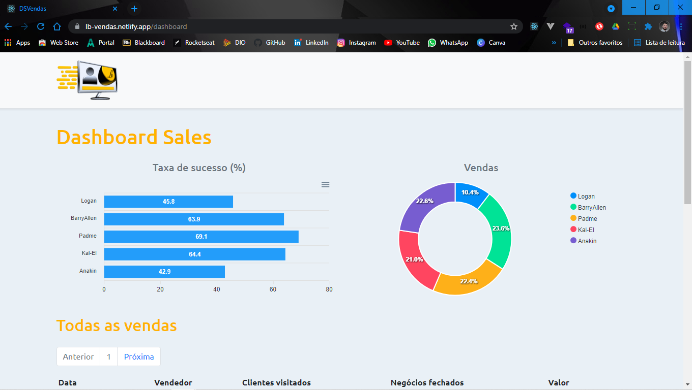
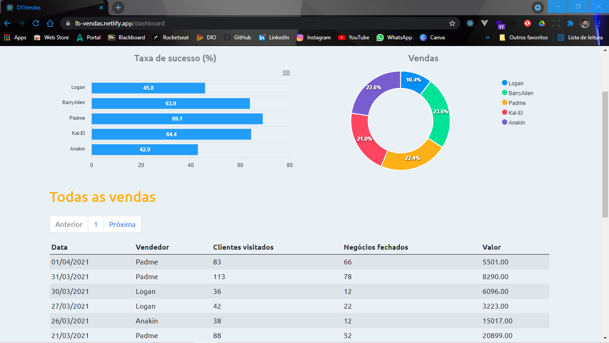
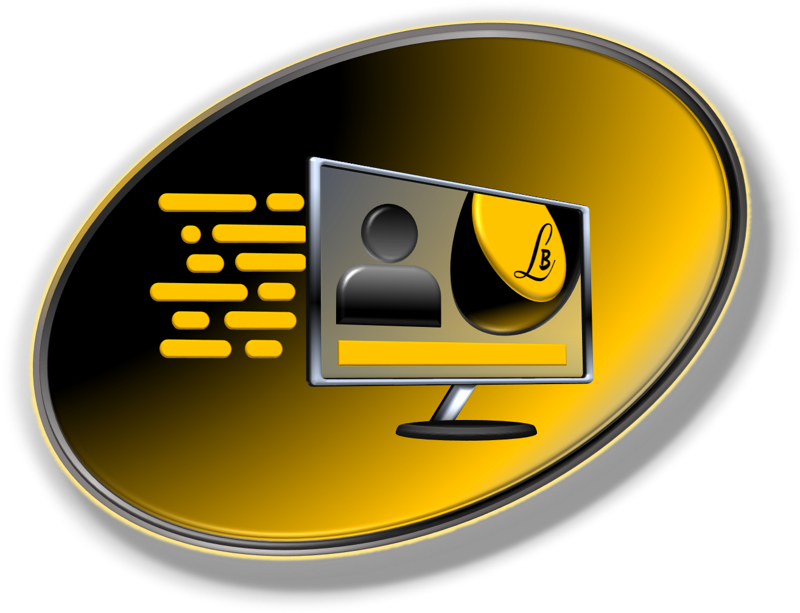

<br>
<p align="center">
  
</p>

<br>

<p>
    <h1 align="center">Dashboard Sales</h1>
</p>

<p align="center">
 <a href="#page_facing_up-sobre-o-projeto">Sobre o Projeto</a> •
 <a href="#-tecnologias">Tecnologias</a> •
 <a href="#closed_book-instalação">Instalação</a> •
 <a href="#memo-licença">Licença</a>
</p>

<br>
<br>

## :page_facing_up: Sobre o projeto

O projeto tem como objetivo o estudo e desenvolvimento de uma aplicação completa rodando no Netlify.

A aplicação foi desenvolvida na semana Spring React 4.0 da DevSuperior utilizando ReactJS para o front-end e Spring para o back-end.

Acesse o App demonstração hospedado no Netlify
- [Dashboard Sales](https://lb-vendas.netlify.app/)

<br>
<br>
<br>

<p align="center">
    <kbd></kbd>
</p>

<br>
<br>
<br>


<p align="center">
    <kbd></kbd>
</p>

<br>
<br>
<br>


<p align="center">
    <kbd></kbd>
</p>

<br>
<br>
<br>


---

## 🛠 Tecnologias

Abaixo as tecnologias utilizadas para construção da aplicação

- [ReactJS](https://reactjs.org/)
- [TypeScript](https://www.typescriptlang.org/)
- [Spring](https://spring.io/)
- [PostgreSQL](https://www.postgresql.org/)
- [Bootstrap](https://getbootstrap.com/)

<br>
<br>

---

## :closed_book: Instalação

### **Requisitos**

Necessário realizar as instalações:

- [JDK 11](https://www.oracle.com/java/technologies/downloads/#java11)
- [Git](https://git-scm.com/)
- [Yarn](https://classic.yarnpkg.com)
- [Postman](https://www.postman.com/)

Criar conta e configurar os serviços externos:

- [Netlify](https://www.netlify.com/)
- [Heroku CLI](https://www.heroku.com)

### **Clone do projeto**

```bash
# Execute o comando git clone para realizar o clone do repositório
$ git clone https://github.com/Lucianobarretto/lbVendas.git
# Entre na pasta do repositório clonado
$ cd lbVendas
```
<br>
<br>

---

## :memo: Licença

Esse projeto está sob sob a licença MIT. Veja LICENSE para mais detalhes.

<br>

<p align="center">  
  <a href="https://github.com/Lucianobarretto/lbVendas/blob/master/LICENSE.md">
    
  </a>
</p>

<br>
<br>

---

<p align="center">
  
</p>

<p align="center">  
  <a href="https://www.linkedin.com/in/lucianobalmeida/">
    
  </a>  
</p>
